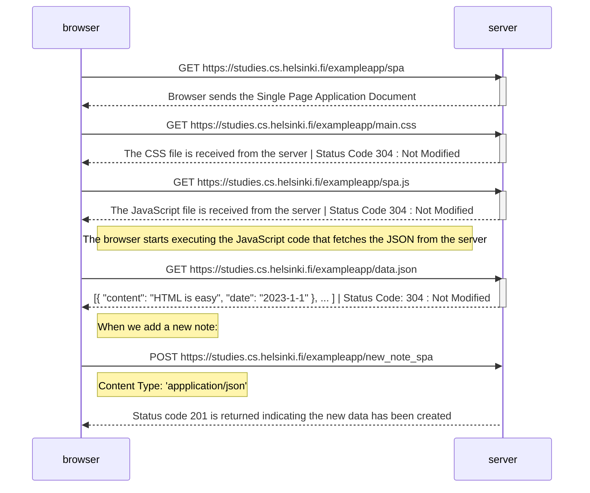

# Exercise 0.5 

Sequence Diagram for Single Page Application

sequenceDiagram
participant browser
participant server

    browser->>server: GET https://studies.cs.helsinki.fi/exampleapp/spa
    activate server
    server-->>browser: Browser sends the Single Page Application Document
    deactivate server

    browser->>server: GET https://studies.cs.helsinki.fi/exampleapp/main.css
    activate server
    server-->>browser: The CSS file is received from the server | Status Code 304 : Not Modified
    deactivate server

    browser->>server: GET https://studies.cs.helsinki.fi/exampleapp/spa.js
    activate server
    server-->>browser: The JavaScript file is received from the server | Status Code 304 : Not Modified
    deactivate server

    Note right of browser: The browser starts executing the JavaScript code that fetches the JSON from the server

    browser->>server: GET https://studies.cs.helsinki.fi/exampleapp/data.json
    activate server 
    server-->>browser: [{ "content": "HTML is easy", "date": "2023-1-1" }, ... ] | Status Code: 304 : Not Modified
    deactivate server

    Note right of browser: When we add a new note: 
    
    browser->>server: POST https://studies.cs.helsinki.fi/exampleapp/new_note_spa
    Note right of browser: Content Type: 'appplication/json'
    activate server
    server-->>browser: Status code 201 is returned indicating the new data has been created
