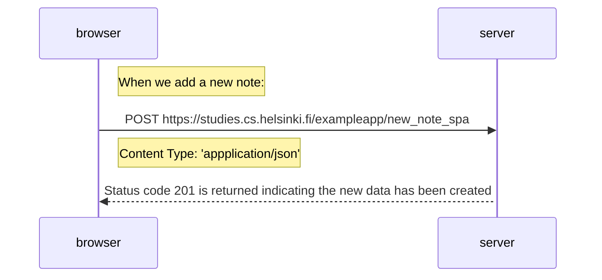

# Exercise 0.6 

This if the sequence diagram for when we add a new note to the SPA

sequenceDiagram
participant browser
participant server

    Note right of browser: When we add a new note:

    browser->>server: POST https://studies.cs.helsinki.fi/exampleapp/new_note_spa
    Note on right of browser: Content Type: 'appplication/json'
    activate server
    server-->>browser: Status code 201 is returned indicating the new data has been created
